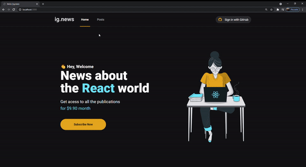

<h1 align="center">
    
</h1>

<h2 align="center">Ig.news</h2>

 

    

  <a href="#-tecnologias">Introdução</a>&nbsp;&nbsp;&nbsp;|&nbsp;&nbsp;&nbsp;
  <a href="#-projeto">Tecnologias</a>&nbsp;&nbsp;&nbsp;|&nbsp;&nbsp;&nbsp;
  <a href="#-projeto">Conteúdo Técnico</a>&nbsp;&nbsp;&nbsp;|&nbsp;&nbsp;&nbsp;
  <a href="#-tecnologias">Observações</a>&nbsp;&nbsp;&nbsp;

## 📦 Introdução

Ig.news é uma plataforma que mostra as noticias sobre a linguagem de programação React.JS, onde é oferecido um plano de assinatura mensal
de $9.90 para ter acesso a todas as portagens.

## 📦 Tecnologias

- Next.Js
- NextAuth.js
- Sass
- Stripe
- FaunaDB
- Prismic

## 📦 Conteúdo Técnico

Falando sobre o conteúdo técnico, o sistema foi desenvolvido com Next.Js, utilizando NextAuth.js para autenticação dos usuários através de uma conta no Github, FaunaDB como banco de dados e Stripe para trabalhar com a forma de pagamento

## 📦 Observações

- Para rodar a aplicação é preciso ter uma conta no github
- É necessário configurar as variáveis de ambiente dentro de um arquivo na raiz do projeto `.env.local`
- É obrigatório ter a CLI do Stripe na maquina para poder, apos isso é só rodar o comando no terminal `stripe listen --forward-to localhost:3000/api/webhooks`
